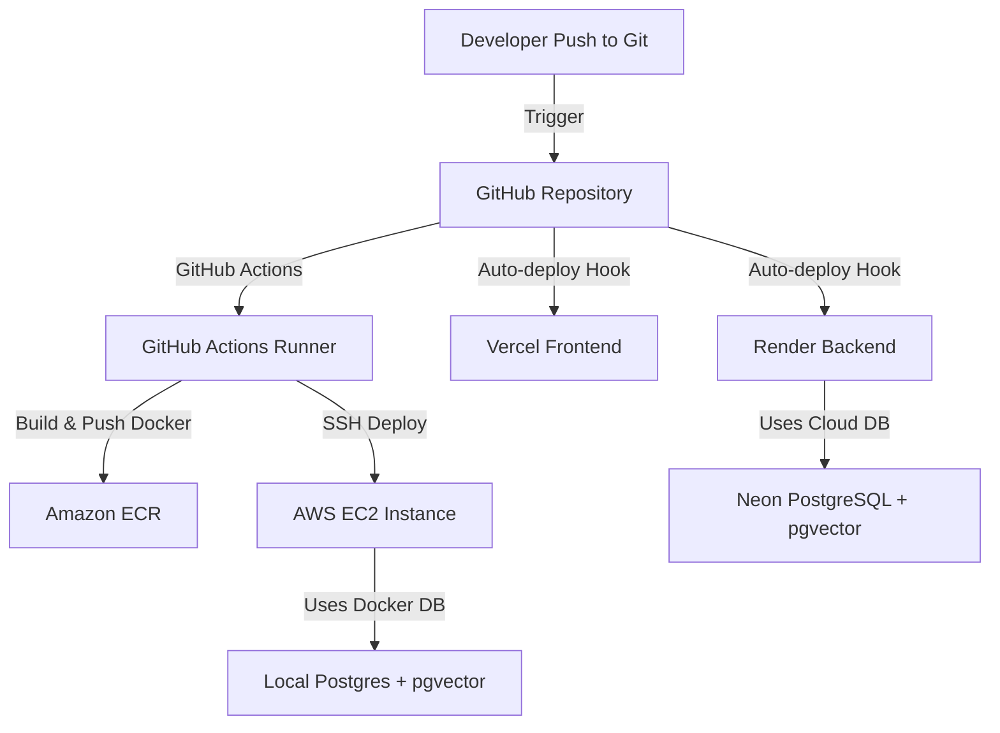

# AI Knowledge Assistant – Multi-Agent RAG Platform

A production-ready, full-stack Retrieval-Augmented Generation (RAG) platform that enables users to upload document corpora (PDF, DOCX, TXT, MD) and engage in conversational Q&A. Instead of using a single monolithic LLM call, this platform orchestrates a multi-agent system powered by **LangGraph** to route queries, retrieve semantic contexts, stream answers, and critique citations.

---

## 🚀 Key Highlights

*   **Multi-Agent Coordination (LangGraph):** Orchestrates four specialized agents (Router, Retriever, Generator, and Citation Critic) in a state machine to minimize hallucinations and guarantee grounded responses.
*   **Hybrid Search Engine (pgvector + FTS):** Integrates semantic cosine similarity search using `pgvector` with native PostgreSQL Full-Text Search (FTS) to ensure both high conceptual recall and keyword precision.
*   **Token-Streaming Response (FastAPI SSE):** Real-time generation streaming using Server-Sent Events (SSE) for a fluid, responsive chat experience.
*   **Automated Ingestion Pipeline:** Extracts text from multi-format files, splits documents into semantic chunks with a configurable overlap, generates vector embeddings using the Google Gemini Embedding API, and saves them to a vector index.
*   **Granular Citation Interface:** Features a grounding agent that maps claims back to specific document sources, represented in the React frontend as interactive, hoverable inline citations.
*   **Enterprise-Grade Platform Controls:** Equipped with JWT-based authentication (secure access/refresh tokens), Redis-backed rate limiting (Token Bucket pattern), and an Admin Dashboard showcasing latency and query volume analytics.
*   **Production DevOps:** Structured with multi-stage Docker builds, `docker-compose` for local parity, and GitHub Actions CI/CD workflows targeting AWS EC2.

---

## 🏗️ Architecture Overview

The system architecture utilizes a decoupled frontend and backend that communicate via a FastAPI gateway utilizing REST endpoints and SSE streaming.

```
┌────────────────┐     ┌──────────────┐     ┌──────────────────────────────────────────┐
│   React UI     │────▶│  FastAPI     │────▶│          LangGraph Agent Graph           │
│ (Chat, Upload, │◀────│ (REST + SSE) │◀────│                                          │
│  Admin Charts) │     └──────────────┘     │  ┌───────────┐  ┌───────────┐            │
└────────────────┘            │             │  │  Router   │─▶│ Retriever │            │
                              │             │  │  Agent    │  │   Agent   │            │
                       ┌──────▼──────┐      │  └───────────┘  └─────┬─────┘            │
                       │  PostgreSQL │      │                       ▼                  │
                       │  + pgvector │◀─────┼─────────────────┌───────────┐            │
                       │ (Docs & Chat│      │                 │ Generator │            │
                       │   History)  │      │                 │   Agent   │            │
                       └─────────────┘      │                 └─────┬─────┘            │
                                            │                       ▼                  │
                                            │                 ┌───────────┐            │
                                            │                 │ Citation  │            │
                                            │                 │  Critic   │            │
                                            │                 └───────────┘            │
                                            └───────────────────────┬──────────────────┘
                                                                    ▼
                                                            Google Gemini API
```

### Multi-Agent State Machine Roles

1.  **Router Agent:** Classifies incoming inputs (e.g., greetings, new queries, follow-up queries, out-of-scope questions) and routes execution accordingly.
2.  **Retriever Agent:** Performs query rewriting to maximize retrieval accuracy, queries the PostgreSQL `pgvector` store with hybrid weights, and re-ranks top-$k$ documents.
3.  **Generator Agent:** Assembles context from retrieved documents and session history, constructs prompts, and invokes the LLM to generate a draft response.
4.  **Citation Critic Agent:** Evaluates the draft response against the retrieved source chunks, assigns inline citation numbers (`[1]`, `[2]`), flags hallucinations, and edits the response to ensure strict grounding.

---

## 🛠️ Technology Stack

| Layer | Technologies | Description |
| :--- | :--- | :--- |
| **Frontend** | React (Vite), Tailwind CSS, React Query | Interactive UI, SSE parsing, and responsive layout. |
| **Backend API** | FastAPI (Python 3.11) | High-performance asynchronous API router. |
| **Orchestration** | LangGraph, LangChain | Multi-agent state graphs and chain builders. |
| **Models** | Google Gemini API (`gemini-1.5-flash` / `gemini-1.5-pro` & `text-embedding-004`) | Context embedding, processing, and generation. |
| **Database** | PostgreSQL + `pgvector` | Unified vector embedding and relational metadata storage. |
| **Caching/Limit** | Redis, `slowapi` | In-memory token bucket rate limiting. |
| **Testing** | PyTest, `httpx` AsyncClient | Integration, unit, and retrieval pipeline tests. |
| **DevOps** | Docker, Docker Compose, GitHub Actions, AWS EC2 | Production containerization and automated deployments. |

---

## 📂 Project Structure

```
.
├── backend/
│   ├── app/
│   │   ├── main.py                  # FastAPI entrypoint & middleware configuration
│   │   ├── core/                    # Security (JWT), rate limiting, and global configurations
│   │   ├── api/                     # Route controllers (auth, documents, chat, admin)
│   │   ├── agents/                  # LangGraph multi-agent implementation & state definition
│   │   ├── rag/                     # Parsers, text splitters, embeddings, and vector queries
│   │   ├── models/                  # SQLAlchemy database models
│   │   ├── schemas/                 # Pydantic validation schemas
│   │   ├── db/                      # DB session management & Alembic migrations
│   │   └── services/                # Core business logic for chats, docs, and analytics
│   ├── tests/                       # PyTest automated test suites
│   ├── Dockerfile                   # Multi-stage backend build script
│   └── requirements.txt             # Python dependencies
├── frontend/
│   ├── src/
│   │   ├── pages/                   # Views (Login, Chat, Documents, Admin Dashboard)
│   │   ├── components/              # Reusable UI components (Citations, Dropzone, Charts)
│   │   ├── hooks/                   # Custom hooks (SSE streaming parser, auth)
│   │   ├── api/                     # HTTP and connection client configurations
│   │   └── App.jsx                  # React entry point & routing configuration
│   ├── Dockerfile                   # Single/multi-stage frontend containerization
│   └── package.json                 # Frontend dependencies and scripts
├── docker-compose.yml               # Local multi-container development orchestrator
└── README.md
```

---

## ⚡ Getting Started

### Prerequisites

*   Python 3.11+
*   Node.js 18+
*   Docker & Docker Compose
*   A Gemini API Key (obtained from [Google AI Studio](https://aistudio.google.com/))

### Quickstart (Docker Compose)

The easiest way to spin up the entire platform locally (React app, FastAPI app, pgvector database, and Redis cache) is via Docker Compose:

1.  Clone the repository:
    ```bash
    git clone https://github.com/your-username/AI-Knowledge-Assistant.git
    cd AI-Knowledge-Assistant
    ```

2.  Create a `.env` file in the root directory and specify the required values:
    ```env
    # Database Config
    DATABASE_URL=postgresql+psycopg://postgres:postgres@db:5432/rag_db
    
    # Redis Config
    REDIS_URL=redis://redis:6379/0
    
    # LLM Provider Keys
    GOOGLE_API_KEY=your_gemini_api_key_here
    
    # Security Configurations
    SECRET_KEY=your_super_secret_jwt_key
    ALGORITHM=HS256
    ACCESS_TOKEN_EXPIRE_MINUTES=30
    ```

3.  Build and run the containers:
    ```bash
    docker-compose up --build
    ```

4.  Access the applications:
    *   **React Frontend:** `http://localhost:5173`
    *   **FastAPI Backend Swagger Docs:** `http://localhost:8000/docs`

---

## 🔧 Manual Setup & Run (Development Mode)

If you prefer running the components directly on your local system:

### 1. Vector Database Setup
1. Spin up a PostgreSQL instance with the `pgvector` extension enabled.
2. Connect to the database and enable the vector extension:
   ```sql
   CREATE EXTENSION IF NOT EXISTS vector;
   ```

### 2. Backend Setup
1. Navigate to the backend directory:
   ```bash
   cd backend
   ```
2. Create and activate a virtual environment:
   ```bash
   python -m venv venv
   # On Windows:
   .\venv\Scripts\activate
   # On macOS/Linux:
   source venv/bin/activate
   ```
3. Install dependencies:
   ```bash
   pip install -r requirements.txt
   ```
4. Configure environment variables in a `.env` file within the `backend` folder.
5. Run database migrations:
   ```bash
   alembic upgrade head
   ```
6. Start the server using Uvicorn:
   ```bash
   uvicorn app.main:app --reload --app-dir .
   ```

### 3. Frontend Setup
1. Navigate to the frontend directory:
   ```bash
   cd ../frontend
   ```
2. Install npm dependencies:
   ```bash
   npm install
   ```
3. Configure `VITE_API_BASE_URL` in a `.env` file:
   ```env
   VITE_API_BASE_URL=http://localhost:8000
   ```
4. Launch the Vite dev server:
   ```bash
   npm run dev
   ```

---

## 📊 Benchmarks & Performance Targets

Designed with optimization first, the system is engineered to handle enterprise corpora efficiently:

| Metric | Target | Solution |
| :--- | :--- | :--- |
| **Retrieval Latency** | `300–500 ms` | Database indexing (`ivfflat` index on embeddings), connection pooling via SQLAlchemy, and asynchronous database sessions. |
| **End-to-End Latency** | `2–4 seconds` | Asynchronous node execution in LangGraph, stream processing via SSE, and parallelized retrieval logic. |
| **Ingestion Pipeline** | `~2 seconds` per PDF | FastAPI background tasks, chunk batching, and lightweight loaders (PyMuPDF). |
| **Vector Dimension** | 768 dimensions | Optimized embedding matching based on the `text-embedding-004` model. |

---

## 🧪 Testing

The repository maintains high code quality using a structured test suite powered by `pytest` and `httpx`.

### Running the Test Suites

1. **Integration Pipeline Test** (runs a mock user sign-up, login, file upload, ingestion status polling, SSE chat querying, and document deletion flow):
   ```bash
   cd backend
   # On Windows (PowerShell):
   $env:PYTHONPATH="."
   python -m pytest tests/test_retrieval_pipeline.py -v
   # On macOS/Linux:
   PYTHONPATH=. pytest tests/test_retrieval_pipeline.py -v
   ```

2. **Vector Search Performance Latency Benchmark** (runs 50 queries against a mock vector database of 100 sentences with 768-dimension embeddings, sorting and measuring the 95th percentile retrieval latency):
   ```bash
   cd backend
   # On Windows (PowerShell):
   $env:PYTHONPATH="."
   python -m pytest tests/test_perf.py -s
   # On macOS/Linux:
   PYTHONPATH=. pytest tests/test_perf.py -s
   ```

### 📈 Verified Test & Performance Results

* **End-to-End Pipeline (`test_retrieval_pipeline.py`)**: `PASSED` (1 passed in ~19.34 seconds).
* **pgvector Search Latency Benchmark (`test_perf.py`)**: `PASSED` with a measured 95th percentile (p95) latency of **29.38ms** (well under the target SLA threshold of `< 300.0ms`).

---

---

## 🌐 Deployment (Dual-Deployment Architecture)

This repository supports a production-grade dual deployment pipeline:



### Option A: Free Serverless Stack (Fastest Setup)
*   **Frontend:** Hosted on [Vercel](https://vercel.com/) linked to the repository for auto-deploy.
*   **Backend:** Hosted on [Render](https://render.com/) as a Web Service.
*   **Database:** [Neon.tech](https://neon.tech/) Serverless Postgres with `pgvector` enabled.
*   **Cache:** [Upstash](https://upstash.com/) Serverless Redis for distributed rate-limiting.

### Option B: AWS EC2 Instance Deployment (Standard Production)
*   Deploys a single `t2.micro` or `t3.micro` EC2 instances.
*   Leverages a custom GitHub Actions workflow (`.github/workflows/ci-cd.yml`) that builds docker images, uploads them to AWS ECR, and triggers a rolling container rebuild on the virtual machine via SSH commands.

---

## 🗺️ Roadmap & Planned Enhancements

*   [ ] **Celery + Redis Worker Transition:** Offload document ingestion tasks from local threads to a distributed queue system to handle heavy batch uploads.
*   [ ] **PDF In-Viewer Bounding Box Highlights:** Upgrade the React UI to display the original PDF inside a split-pane, highlighting the exact sentences retrieved by the semantic search engine.
*   [ ] **Cost Estimation Tracking:** Expose LLM API costs per user directly on the Admin Analytics Dashboard.
*   [ ] **JWT HttpOnly Cookies:** Migrate session handling from localStorage to secure, HttpOnly, SameSite cookies to protect against XSS attacks.

---

## 📄 License

This project is licensed under the MIT License - see the [LICENSE](LICENSE) file for details.
